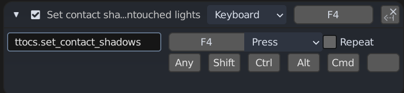
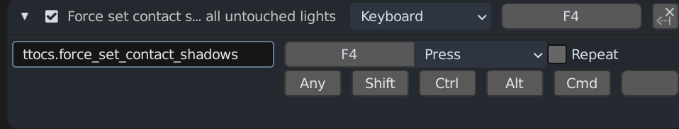

# 3-2-1 Contact(Shadow)

An easy way to let you enable contact shadows on all your lights, because
Blender doesn't enable it by default, and doesn't give you a way to enable
it by default, even though it'd be damned useful if it was enabled by default.

So, enter this stupid thing, which will enable contact shadows on all lights
in your scene, and is smart enough not to try to re-enable them on a light
where they've been automatically enabled, and then disabled by hand. This
means you can still have lights without contact shadows, if you'd like.

It's disappointing that Blender doesn't have a hook for "new object created"
so that this could be automatically triggered any time you create a light.
Alas, for now, you have to activate it manually.

## Installation

It's a Blender addon. It installs like a Blender addon.

## Usage

3-2-1 Contact(Shadow) provides two operators, which you will need to bind
to keys (via `Edit > Preferences > Keymap`). I added it under `3D View >
3D View (Global)`, which should work for you, as well. The two operators
are:

`ttocs.set_contact_shadows`: Enable contact shadows on all lights. A hidden
property is added to each like marking it as processed, and lights that have
been processed won't be processed again -- so if you then turn off contact
shadows on a light, they will _stay_ off.

`ttocs.force_set_contact_shadows`: Enable contact shadows on all lights,
unconditionally. Even if you've manually disabled contact shadows on some
lights, they will be reenabled if you use this operator.

## Example bindings

## Future

No immediate plans, but if you need more features (or have a bug report),
feel free to open an issue and we'll try to make it happen!
